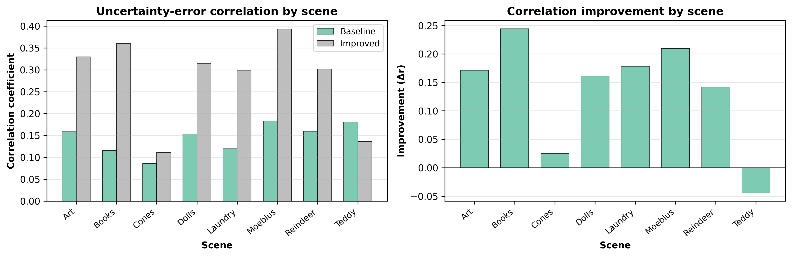
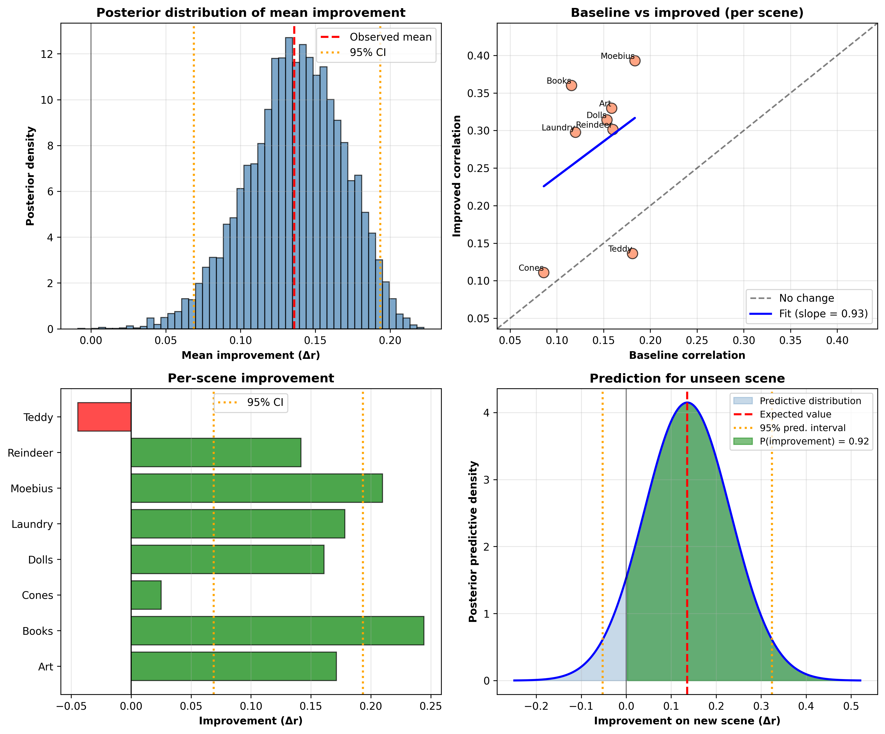
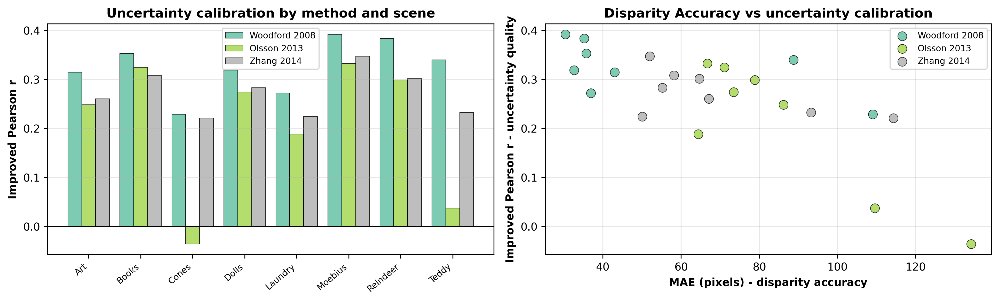
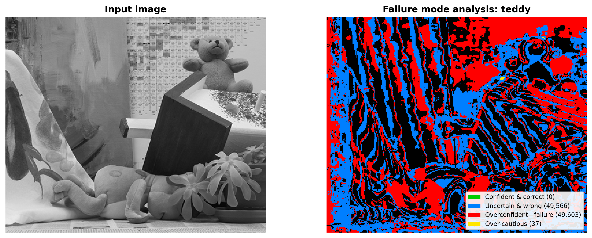

# Uncertainty Estimation in Stereo Matching: A Multi-Component Framework for Disparity Confidence

A training-free uncertainty framework for classical stereo matching. Combines six per-pixel components (curvature, uniqueness ratio, occlusion detection, spatial consistency, left-right consistency, and texture-adaptive weighting) into a single confidence map. No GPU, no labelled training data, no dependency on a specific stereo pipeline.

## Headline result

| Metric | Inverse curvature baseline | Six-component framework |
|---|---|---|
| Mean Pearson r (uncertainty vs. error) | 0.145 | **0.281** |
| 95% credible interval on Δr | n/a | [0.065, 0.200] |
| P(Δr > 0) from Bayesian bootstrap | n/a | **100%** |
| P(Δr > 0.05) | n/a | 99.9% |

Evaluated on eight Middlebury scenes (Art, Books, Cones, Dolls, Laundry, Moebius, Reindeer, Teddy). The improvement is statistically certain on the six 2005 scenes. Cones and Teddy regress or stagnate due to a near-100% bad-pixel rate under the census pipeline. We report both.

The inverse curvature baseline reproduces the r = 0.10 result from Hu and Mordohai (2012) at r = 0.145 on our scenes.

## Per-scene results

| Scene | MAE (px) | Bad-1.0 (%) | Baseline r | Improved r | Δr |
|---|---|---|---|---|---|
| Art | 26.42 | 42.65 | 0.158 | 0.330 | +0.171 |
| Books | 23.30 | 54.96 | 0.116 | 0.360 | +0.244 |
| Cones | 102.71 | 100.00 | 0.086 | 0.111 | +0.025 |
| Dolls | 16.67 | 36.04 | 0.153 | 0.314 | +0.161 |
| Laundry | 31.04 | 58.39 | 0.120 | 0.298 | +0.178 |
| Moebius | 17.69 | 34.94 | 0.183 | 0.393 | +0.210 |
| Reindeer | 18.29 | 36.43 | 0.160 | 0.301 | +0.142 |
| Teddy | 84.03 | 99.99 | 0.181 | 0.136 | -0.044 |
| **Mean** | 40.02 | 57.93 | 0.145 | 0.281 | +0.136 |

Full per-scene visualisations (input, ground truth, predicted disparity, error map, texture strength, baseline uncertainty, improved uncertainty, uncertainty-vs-error scatter) are in [`results/`](results/).

Per-scene figures:
- [Art](results/art_results.png)
- [Books](results/books_results.png)
- [Cones](results/cones_results.png)
- [Dolls](results/dolls_results.png)
- [Laundry](results/laundry_results.png)
- [Moebius](results/moebius_results.png)
- [Reindeer](results/reindeer_results.png)
- [Teddy](results/teddy_results.png)

## Bayesian analysis

10,000 Bayesian bootstrap resamples over the eight-scene set. The posterior mean for Δr is 0.136 with a 95% credible interval of [0.065, 0.200]. The interval excludes zero. The posterior predictive distribution for an unseen scene assigns P(improvement) = 0.92.

## Ablation

| Component combination | Mean r | Std r |
|---|---|---|
| Curvature only | 0.083 | 0.034 |
| Uniqueness only | 0.069 | 0.015 |
| Consistency only | 0.299 | 0.136 |
| Curvature + Uniqueness | 0.100 | 0.034 |
| Curvature + Uniqueness + Consistency | 0.225 | 0.089 |
| Full (+ occlusion) | 0.232 | 0.082 |
| Full adaptive (this work) | 0.281 | 0.102 |

Spatial consistency alone scores higher mean r than the full framework (0.299 vs. 0.281), but with substantially higher variance across scenes (0.136 vs. 0.102). The full framework trades a small amount of mean r for more stable per-scene calibration and more spatially diverse uncertainty maps.

## Cross-method transfer

The same census-derived uncertainty framework was applied to disparity maps from three SGBM-based approximations of more recent stereo methods (Woodford 2008, Olsson 2013, Zhang 2014). The census cost volume used for uncertainty estimation was recomputed independently of each method's disparity output.

| Method approximation | Mean improved r | Mean Δr |
|---|---|---|
| Woodford 2008 (SGBM) | 0.325 | +0.238 |
| Olsson 2013 (SGBM-HH) | 0.208 | +0.130 |
| Zhang 2014 (SGBM + SLIC plane fitting) | 0.272 | +0.186 |

Positive Δr on 23 of 24 method-scene combinations. The single negative case is Olsson on Cones (Δr = -0.038), where the underlying disparity map fails uniformly. These are approximations of the original methods via SGBM parameter changes, not faithful reimplementations, and the results should be read accordingly.

## Failure modes

Each pixel is classified into one of four categories: confident and correct, uncertain and wrong, overconfident failure, or over-cautious.

| Scene | Correct (%) | Unc. & wrong (%) | Overconfident (%) | Over-cautious (%) |
|---|---|---|---|---|
| Art | 44.7 | 33.7 | 5.3 | 16.3 |
| Dolls | 45.8 | 26.8 | 4.2 | 23.2 |
| Teddy | 0.0 | 50.0 | 50.0 | 0.0 |

Overconfidence stays below 5.5% on well-matched scenes. Teddy collapses because the underlying disparity map is uniformly wrong, leaving the framework no correctly estimated regions to identify as confident. Cost-curve-based uncertainty signals do not recover when every pixel is incorrectly matched. We report this rather than excluding the scene.

Full failure mode maps:
- [Art failure modes](results/art_failure_modes.png)
- [Dolls failure modes](results/dolls_failure_modes.png)
- [Teddy failure modes](results/teddy_failure_modes.png)

## Approach in brief

1. Census transform with a 5×5 window, box-filtered cost aggregation (9x9, or 11×11 for Cones and Teddy).
2. Winner-takes-all selection with parabola-based subpixel refinement.
3. Six per-pixel uncertainty components computed from the cost volume and disparity map.
4. Texture-adaptive weighting: in high-texture regions, curvature is weighted higher; in low-texture regions, uniqueness takes over. Spatial consistency and left-right consistency apply as multiplicative penalties.

All stages run on CPU. No model weights, no training, no calibration set.

## Limitations

- Eight Middlebury scenes only. Generalisation to KITTI, ETH3D, or recent Middlebury splits has not been tested.
- The cross-method comparison uses SGBM parameter approximations of the cited methods, not faithful reimplementations. PatchMatch Stereo was excluded due to CPU infeasibility at full Middlebury resolution.
- Left-right consistency for the cross-method experiments is derived from the recomputed census cost volume rather than from each method's own cost volume, since OpenCV SGBM does not expose its internal cost volume.
- Cones and Teddy from Middlebury 2003 required manual disparity range overrides due to encoding inconsistencies in the 2003 format.

## Citations and credit

The framework builds on the standard inverse-curvature confidence measure described by Hu and Mordohai (2012) and uses the census transform of Zabih and Woodfill (1994). The anchor stereo method modelled is Woodford et al. (2008). Texture-adaptive weighting follows the conceptual approach of Kim et al. (2019). Full references are in the report PDF.

## License

MIT.